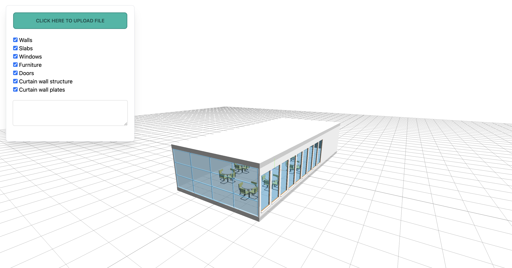
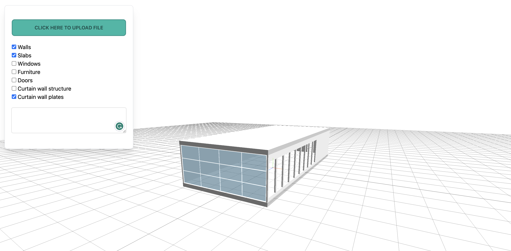

<h1></h1>

## Quick setup

First, download this project or clone the repository. You can then install the dependencies using:

```bash
npm install
```

and build app.js with:

```bash
npm run build
```

`npm run build` will bundle the project and create a file called bundle.js in the root directory of the project.
and you can active the watch mode :

```bash
npm run watch
```

`npm run watch` will activate the watch mode, updating that file automatically every time we make changes to the code and save it.

You can then execute the project serving locally with any library of your choosing (e.g. [reload](https://www.npmjs.com/package/reload)) and VSCode Extensions (e.g. [Live Server](https://marketplace.visualstudio.com/items?itemName=ritwickdey.LiveServer)).

## Introduction

Creating a BIM application with IFC.js is very easy. You can find the complete project of the guide [here](https://github.com/IFCjs/hello-world/tree/main/examples/web-ifc-three/helloworld). You only need to have [Node.js](https://nodejs.org/en/) and any IDE installed to follow the steps below. Also, if you don't have any IFC files to follow along, you can get some [here](https://github.com/IFCjs/test-ifc-files) or use example file in this project ( `readme/01.ifc` ).

Using IFC.js requires a basic knowledge of web development (HTML, CSS, JavaScript) and Three.js. If you have no previous experience with Three.js, you should probably look [here](https://threejs.org/manual/).

## Usage

We will use IFC.js to load IFC files. This can be done by instantiating the loader and creating an event for when the user uploads an IFC file to the HTML input element.

If you have done everything correctly, you should be able to see something similar to [this](https://ifcjs.github.io/hello-world/examples/web-ifc-three/helloworld/) in your local server.


In many BIM applications it is also possible to hide and isolate elements. A common use case is to hide all elements that do not comply with a certain filter or show only those objects belonging to a floor of the building. You can show or hide items using checkboxes.
